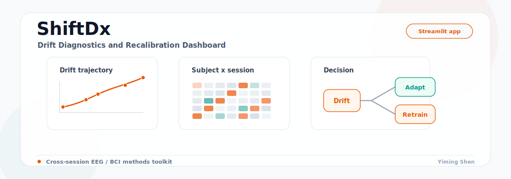
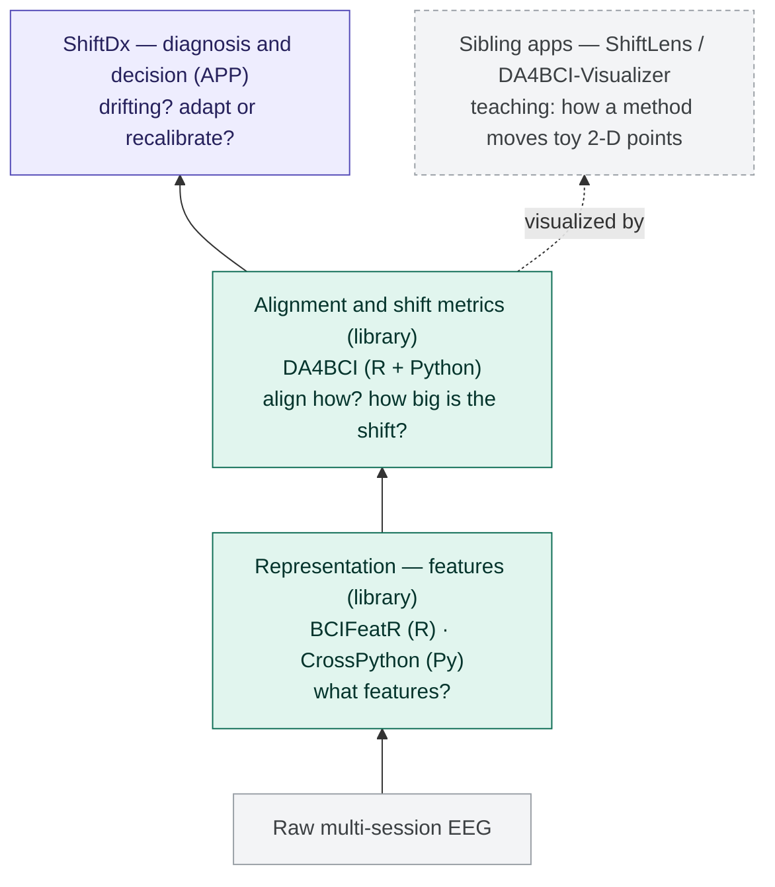

# ShiftDx

<p align="center">
  
</p>

**Drift Diagnostics & Recalibration Dashboard for multi-session MI-EEG BCI.**

**▶ Live demo — runs entirely in your browser, nothing to install:** https://yiming-s.github.io/ShiftDx/

> **ShiftDx is not a feature or DA library** — it is the **diagnostics & decision
> dashboard** that sits on top of [BCIFeatR](https://github.com/Yiming-S/BCIFeatR) /
> [CrossPython](https://github.com/Yiming-S/CrossPython) (features) and
> [DA4BCI](https://github.com/Yiming-S/DA4BCI) (adaptation). It answers the one
> question a method library can't: *is my deployed BCI drifting across sessions,
> by how much, and should I adapt or recalibrate?*

An interactive companion to the paper *Drift Diagnostics, Adaptation, and
Recalibration in Multi-Session Motor-Imagery EEG* (Shen & Degras, 2026). ShiftDx
runs a **fixed-reference deploy-and-monitor** protocol — the feature extractor and
classifier are fit on session 0 and applied unchanged to every later session,
mimicking real-world deployment after a single calibration — and turns it into:

- **testable claims** about cross-session drift (paper §5), backed by
  **paper-grade statistics**: mixed-effects regression, Benjamini–Hochberg FDR
  correction, and subject-clustered bootstrap confidence intervals;
- a concrete **adapt-vs-retrain decision**: how much of the No-DA → Retrain gap a
  DA method actually closes, and when retraining is unavoidable.

The 10 DA methods, 5 distance metrics, and the online drift detector come from
[DA4BCI](https://github.com/Yiming-S/DA4BCI) /
[DA4BCI-Python](https://github.com/Yiming-S/DA4BCI-Python); benchmark datasets
come from [MOABB](https://moabb.neurotechx.com/). **ShiftDx's own contribution is
the diagnosis-and-decision layer on top — not the methods.**

## How ShiftDx relates to the toolkit

ShiftDx is the top, interpretive layer of a stack. Raw EEG becomes features
(BCIFeatR / CrossPython); features are aligned and their shift quantified
(DA4BCI); ShiftDx turns those results into a drift diagnosis and a recalibration
decision.



**Two boundaries to keep straight.**

*Library vs application.* BCIFeatR and DA4BCI are libraries you `import` and call
from your own pipeline; ShiftDx is an application you open in a browser that
*interprets* their output. It invents neither features nor DA methods.

| | Type | You… |
|---|---|---|
| BCIFeatR · CrossPython · DA4BCI | library | import & call from code |
| **ShiftDx** | application | open in a browser; it interprets results |

*Diagnosis app vs teaching app.* The apps most easily confused with ShiftDx are
its siblings ShiftLens / DA4BCI-Visualizer — but they answer a different question:

| App | Job | Data | Audience |
|---|---|---|---|
| ShiftLens · DA4BCI-Visualizer | show *how* a DA method works | toy 2-D | learners |
| **ShiftDx** | measure *how much* drift costs & decide what to do | real multi-session EEG | researchers / deployers |

> The Visualizer shows *how a method works*; ShiftDx shows *how much drift costs
> you and what to do about it.*

**Naming across the ecosystem.**

- **DA4BCI family** (R · Python · Visualizer) — domain-adaptation *methods and
  intuition*.
- **Shift family** — *ShiftLens* = "DA Method Explorer" (teaching);
  *ShiftDx* = "Drift Diagnostics & Recalibration Dashboard" (empirical).

> **Roadmap / integration.** ShiftDx currently extracts features via CrossPython.
> [BCIFeatR](https://github.com/Yiming-S/BCIFeatR) is the richer feature library
> (FBCSP, ACM-TS, ATM, MVAR/MSVAR, bandpower, Hjorth, …); an optional BCIFeatR (R)
> feature backend for `scripts/build_moabb.py` is planned, which would wire all
> three repositories into a single stack.

## What the dashboard shows

- **Overview + Drift Trajectory** — dataset coverage, per-subject MMD /
  Energy / Wasserstein / Mahalanobis / Euclidean trajectory, subject × session
  heatmaps.
- **Claim Explorer** (paper §5) — four testable claims with mixed-effects
  regression, forest plots of β across (feature × classifier × metric),
  DA-method "fan" chart across drift quartiles, and retraining-gap dumbbells.
- **Deep Dive** — per-subject drift + accuracy evolution under all three
  strategies (No DA / DA / Retrain).
- **DA Lab (DA4BCI)** — live DA sandbox, multi-metric drift panel, 10-method
  Pareto sweep, and an online drift detector (Page-Hinkley).

---

## Feature families (3)

Each feature family is fit once on session 0 and applied unchanged to all later
sessions (fixed-reference protocol). All three are exported for every experiment.

| Feature | Dim | Implementation | Description |
|---|---|---|---|
| **CSP** (Common Spatial Patterns) | 8 components | `mne.decoding.CSP(n_components=8, log=True)` | Spatial filters that maximize the class-variance ratio between left-hand and right-hand trials; returns log-variance of projected signals. The de-facto standard MI feature. |
| **log-variance** | n_channels | `log(var(epoch, axis=time))` | Per-channel log of trial variance; no spatial filter. Information-limited but well-known to be drift-insensitive (paper Claim 1). |
| **Tangent Space** (AIRM) | n × (n+1) / 2 | `Covariances(estimator="lwf") → TangentSpace(metric="euclid")` (pyriemann) | Per-trial covariance with Ledoit-Wolf shrinkage, logarithmically mapped to the tangent space at the reference mean, then vectorized (upper triangle). Riemannian-geometry features that capture channel-covariance structure. |

---

## DA methods (10, via DA4BCI)

All DA is **unsupervised** on the target (no access to session-k labels). Only
M3D consumes source labels internally. ShiftDx runs every method on every
(subject, target-session, feature, classifier) cell.

| Key | Name | Family | One-line description |
|---|---|---|---|
| `sa` | **SA** — Subspace Alignment | Linear / PCA | Aligns the top-k PCA subspaces of source and target by a closed-form linear map. Fast, yields a constant level shift (paper Claim 2). |
| `tca` | **TCA** — Transfer Component Analysis | Kernel | Learns an RKHS projection where source and target marginals match while data structure is preserved; closed-form eigen-problem. |
| `mida` | **MIDA** — Maximum Independence DA | Kernel (HSIC) | Finds features that are maximally independent of the domain indicator via HSIC. Powerful on structured shifts, but unsupervised → can erase class signal on small data. |
| `coral` | **CORAL** — Correlation Alignment | Second-order | Whitens source covariance and recolors it with target covariance; one ridge-regularized matmul. Fastest method, sensitive to small-sample covariance noise. |
| `gfk` | **GFK** — Geodesic Flow Kernel | Grassmann | Integrates an infinite series of subspaces along the geodesic from source to target on the Grassmann manifold. |
| `rd` | **RD** — Riemannian Distance alignment | SPD manifold | Aligns trial covariances on the SPD manifold by shifting along the AIRM geodesic. |
| `pt` | **PT** — Parallel Transport | SPD manifold | Parallel-transports source covariances to the target Riemannian mean along the geodesic. Level- **and** slope-shifting in paper Claim 2. |
| `art` | **ART** — Aligned Riemannian Transport | SPD manifold | PT combined with an extra whitening / alignment step; often the strongest DA method on MI features in our benchmarks. |
| `ot` | **OT** — Sinkhorn Barycentric Mapping | Optimal transport | Entropy-regularized OT via Sinkhorn-Knopp; projects source onto the target barycentric coupling. Robust on covariance shifts; slower than closed-form methods. |
| `m3d` | **M3D** — Manifold Multi-step DA | Multi-stage | Two-stage alignment (TCA → SA) with iterative kernel refinement; uses source labels to stabilize. Strongest on high-dimensional TS features; can fail silently on tiny (≤6) feature dims. |

---

## Distance metrics (5, via DA4BCI)

Every (source_features, target_features) pair is scored with all five metrics
so users can test whether the paper's conclusions are **metric-robust**
(paper Limitation 4).

| Column | Name | One-line description |
|---|---|---|
| `dist_mmd` | **Maximum Mean Discrepancy** | Kernel-based distance between distributions; RBF kernel with automatic bandwidth (`sigma_med`, median heuristic). Most sensitive to subtle high-moment shifts; **paper default**. |
| `dist_energy` | **Energy distance** | Based on pairwise Euclidean distances within and between samples; distribution-free, scale-sensitive, strictly positive. |
| `dist_wasserstein` | **Wasserstein** | Minimal transport cost between empirical distributions (1-Wasserstein on squared-Euclidean ground cost via POT). Geometry-aware, stable under monotone transforms. |
| `dist_mahalanobis` | **Mahalanobis** | Whitening-aware distance using a shrinkage-estimated pooled covariance (Ledoit-Wolf). Sensitive to correlated feature scales; complementary to MMD. |
| `dist_euclidean` | **Euclidean (mean pairwise)** | Mean of the full source-target pairwise Euclidean distance matrix. Simplest baseline; ignores covariance structure. |

Each is additionally z-scored within (dataset × feature × classifier) blocks and
written as `drift_z_<metric>`. Every Claim page has a metric selector that
re-fits the relevant regression against the chosen z-score.

---

## Classifiers (3, via CrossPython)

| Key | Name | Default params |
|---|---|---|
| `lda` | Linear Discriminant Analysis | `shrinkage="auto"`, `solver="lsqr"` (Ledoit-Wolf) |
| `svm_linear` | SVM (linear kernel) | `C=0.1` |
| `svm_radial` | SVM (radial kernel) | `C=0.1`, `gamma="scale"` |

All three are instantiated via `CrossPython.pipelines.pipeline_utils.get_classifier`.

---

## Quick start

```bash
git clone <this repo>
cd ShiftDx
pip install -r requirements.txt
pip install -e /path/to/DA4BCI-Python         # enables DA Lab pages + build script
export CROSSPYTHON_ROOT=/path/to/CrossPython  # feature / classifier code lives here
streamlit run app.py
```

### Bundled data

Only **zhou2016** and **bnci004** ship as pre-built CSVs in `data/` (small enough
to track in git). The other datasets in `DATASET_META` (stieger2021, ma2020,
bnci2015_001) require a local build from MOABB/raw EEG — the dashboard lists them
with a ❌ status until their CSVs are present and degrades gracefully when a
selection has no data.

To explore the full UI without MOABB, generate a tiny synthetic dataset:

```bash
python scripts/gen_synthetic_demo.py   # writes a "demo_synthetic" dataset into data/
streamlit run app.py
```

### Metric conventions

- **Accuracy** is a proportion (`0–1`) in tables (`.3f`); it is shown as a
  percentage only in KPI cards and bar charts.
- **Drift** is z-scored within `(dataset × feature × classifier)` blocks
  (`drift_z`); the raw distance is in the `dist_*` columns.
- **p-values** floor at `p<0.001`; the Claim-1 forest plot additionally reports
  Benjamini–Hochberg FDR-adjusted p-values across all fitted cells.
- Confidence intervals on per-subject quantities use a **subject-clustered
  bootstrap** (subjects are the resampling unit) to respect repeated measures.

## Build a dataset from MOABB / local CNT

```bash
# Default: Zhou2016 (4 subjects × 3 sessions × 14 channels)
python scripts/build_moabb.py --dataset zhou2016 \
    --mne-data-dir /path/to/MNE-data-root

# Paper datasets (via CrossPython loader)
python scripts/build_moabb.py --dataset bnci004 --mne-data-dir ...
python scripts/build_moabb.py --dataset stieger2021 --no-slow --mne-data-dir ...
python scripts/build_moabb.py --dataset ma2020 --no-slow --mne-data-dir ...

# Smoke test
python scripts/build_moabb.py --dataset zhou2016 --subjects 1 2 --no-slow
```

`--no-slow` skips MIDA and M3D (useful on Stieger2021 / Ma2020 where these
methods can dominate runtime).

### Datasets supported by the builder

| Short name | MOABB class | Subjects | Sessions | Channels | Paradigm | Loader path |
|---|---|---:|---:|---:|---|---|
| `zhou2016` | Zhou2016 | 4 | 3 | 14 | L/R hand | Direct MOABB |
| `bnci2015_001` | BNCI2015_001 | 12 | 2–3 | 13 | right hand vs feet | Direct MOABB |
| `bnci2014_001` | BNCI2014_001 | 9 | 2 | 22 | L/R hand (binarized) | Direct MOABB |
| `bnci004` | BNCI2014_004 | 9 | 5 | 3 | L/R hand | CrossPython (MOABB) |
| `stieger2021` | Stieger2021 | 62 | 6–11 | 62 | L/R hand | CrossPython (MOABB) |
| `ma2020` | — (custom CNT) | 25 | 15 | 65 | binary MI | CrossPython (CNT reader) |

## Output schema

The script writes three CSVs into `data/`:

- `drift_trajectories_<ds>.csv` — one row per (subject, session_k, feature) with
  all five distance metrics.
- `sequential_eval_<ds>.csv` — one row per (subject, session, feature,
  classifier, DA-or-strategy).
- `merged_drift_accuracy_<ds>.csv` — joined view with `drift_z_<metric>` (z-score
  per block) and `acc_centered = accuracy − baseline`.

The dashboard auto-detects any `drift_trajectories_*.csv` in `data/` and exposes
it in the sidebar selector.

## Page Map

### Overview
- **Dataset Overview** — summary cards, MMD distribution, strategy coverage.
- **Drift Trajectory** — per-subject trajectory + subject × session heatmap (swap
  among five distance metrics).

### Claim Explorer (paper §5)
- **Claim 1 — Drift Predicts Loss** — mixed-effects regression + forest plot of
  β across (feature × classifier × metric).
- **Claim 2 — DA Decomposition** — level shift / slope change table + 12-line
  DA-method fan chart over drift quartiles.
- **Claim 3 — Retraining Gap** — `R_g(z)` fit + "DA closes X %" bars + dumbbell
  of No-DA → DA → Retrain progression.
- **Claim 4 — Feature Robustness** — joint 4-condition pass/fail table with
  ceiling anchor.

### Deep Dive
- **Subject Explorer** — per-subject drift + strategy-wise accuracy evolution.

### DA Lab (DA4BCI)
- **Live DA Sandbox** — synthetic shift scenario, pick a DA method, see
  before/after distances and PCA projection.
- **Multi-Metric Drift Panel** — all five distances side by side with rank-
  preservation analysis and per-metric Claim-1 re-fit.
- **DA Method Sweep** — run every DA method on a scenario, Pareto plot of
  runtime vs alignment quality.
- **Drift Detection Demo** — Page-Hinkley online drift trigger on per-subject
  accuracy series.

## Experiment protocol (summary)

- **Fixed-reference** within-subject: session 0 is calibration; sessions
  1..n−1 are targets.
- **No DA**: train on session 0, predict session k unchanged.
- **DA** (10 methods): adapt source/target features, train on adapted source,
  predict adapted target.
- **Retrain**: 5-fold `StratifiedKFold` on session k itself (oracle ceiling).
- **Baseline**: 5-fold CV on session 0 (reference for `acc_centered`).

All training/testing is cross-session *within-subject*. No cross-subject
transfer.

## References

### Primary paper and benchmarking framework

- Shen, Y. & Degras, D. (2026). *Drift Diagnostics, Adaptation, and Recalibration in Multi-Session Motor-Imagery EEG.* (this dashboard's anchor paper.)
- Jayaram, V. & Barachant, A. (2018). MOABB: trustworthy algorithm benchmarking for BCIs. *J. Neural Eng.* 15(6):066011.
- Gramfort, A. et al. (2013). MEG and EEG data analysis with MNE-Python. *Front. Neurosci.* 7:267.
- Bates, D. et al. (2015). Fitting linear mixed-effects models using lme4. *J. Stat. Softw.* 67(1). (Python equivalent used here: `statsmodels.formula.api.mixedlm`.)

### Motor-imagery EEG datasets

- Zhou, B. et al. (2016). A fully automated trial selection method for optimization of motor-imagery based brain-computer interface. *PLOS ONE* 11(9):e0162657. (**Zhou2016**)
- Tangermann, M. et al. (2012). Review of the BCI Competition IV. *Front. Neurosci.* 6:55. (**BNCI2014_001 / 2014_004**)
- Leeb, R. et al. (2008). BCI Competition 2008 — Graz data set B. (**BNCI2014_004**)
- Faller, J. et al. (2012). Autocalibration and recurrent adaptation. *IEEE TNSRE* 20(3). (**BNCI2015_001**)
- Stieger, J. R. et al. (2021). Continuous sensorimotor rhythm BCI learning. *Scientific Data* 8:98. (**Stieger2021**)
- Ma, Y. et al. (2020). A multi-session MI-EEG dataset. (**Ma2020**)

### Feature extraction

- Ramoser, H., Müller-Gerking, J., & Pfurtscheller, G. (2000). Optimal spatial filtering of single-trial EEG during imagined hand movement. *IEEE TRE* 8(4). (**CSP**)
- Blankertz, B. et al. (2008). Optimizing spatial filters for robust EEG single-trial analysis. *IEEE Signal Process. Mag.* 25(1). (**CSP regularization**)
- Barachant, A., Bonnet, S., Congedo, M., & Jutten, C. (2012). Multiclass BCI classification by Riemannian geometry. *IEEE TBME* 59(4). (**Tangent Space / AIRM**)
- Congedo, M., Barachant, A., & Bhatia, R. (2017). Riemannian geometry for EEG-based BCIs: A primer. *Brain-Computer Interfaces* 4(3).
- Ledoit, O. & Wolf, M. (2004). A well-conditioned estimator for large-dimensional covariance matrices. *J. Multivariate Anal.* 88(2). (**shrinkage covariance used in TS + Mahalanobis**)

### Domain adaptation methods

- Pan, S. J. et al. (2011). Domain adaptation via transfer component analysis. *IEEE TNN* 22(2). (**TCA**)
- Fernando, B. et al. (2013). Unsupervised visual domain adaptation using subspace alignment. *ICCV*. (**SA**)
- Yan, K., Kou, L., & Zhang, D. (2018). Learning domain-invariant subspace using domain features and independence maximization. *IEEE TCYB* 48(1). (**MIDA**)
- Sun, B., Feng, J., & Saenko, K. (2016). Return of frustratingly easy domain adaptation. *AAAI*. (**CORAL**)
- Gong, B. et al. (2012). Geodesic flow kernel for unsupervised domain adaptation. *CVPR*. (**GFK**)
- Zanini, P. et al. (2018). Transfer learning: A Riemannian geometry framework with applications to BCI. *IEEE TBME* 65(5). (**RD alignment**)
- Yair, O., Ben-Chen, M., & Talmon, R. (2019). Parallel transport on the cone manifold of SPD matrices for domain adaptation. *IEEE TSP* 67(7). (**PT / ART**)
- Courty, N., Flamary, R., Tuia, D., & Rakotomamonjy, A. (2017). Optimal transport for domain adaptation. *IEEE TPAMI* 39(9). (**OT**)
- Cuturi, M. (2013). Sinkhorn distances: lightspeed computation of optimal transport. *NeurIPS*. (**Sinkhorn solver used in OT**)
- Flamary, R. et al. (2021). POT: Python Optimal Transport. *JMLR* 22(78). (**library used for OT + Wasserstein**)

### Distance and two-sample tests

- Gretton, A. et al. (2012). A kernel two-sample test. *JMLR* 13. (**MMD**)
- Székely, G. J. & Rizzo, M. L. (2013). Energy statistics: A class of statistics based on distances. *J. Stat. Plan. Inference* 143(8). (**Energy**)
- Villani, C. (2008). *Optimal Transport: Old and New*. Springer. (**Wasserstein**)
- Mahalanobis, P. C. (1936). On the generalized distance in statistics. *Proc. Nat. Inst. Sci. India* 2. (**Mahalanobis**)

### Drift detection

- Page, E. S. (1954). Continuous inspection schemes. *Biometrika* 41(1–2). (**CUSUM, Page-Hinkley basis**)
- Hinkley, D. V. (1971). Inference about the change-point from cumulative sum tests. *Biometrika* 58(3).

### Software

- DA4BCI-Python (this project's DA + distance backend). https://github.com/Yiming-S/DA4BCI-Python
- CrossPython (shared feature / classifier code). https://github.com/Yiming-S/CrossPython
- pyriemann — Riemannian geometry for EEG. https://pyriemann.readthedocs.io/
- scikit-learn, statsmodels, streamlit, plotly — standard SciPy-stack dependencies.

## Authors

**Yiming Shen** and **David Degras**
Department of Mathematics, University of Massachusetts Boston

## License

MIT
